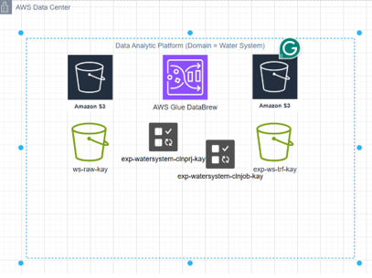
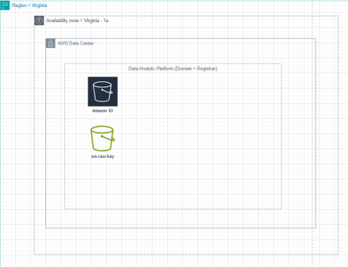
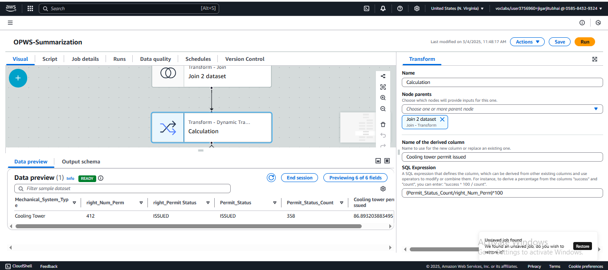
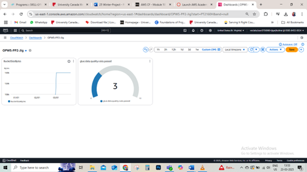
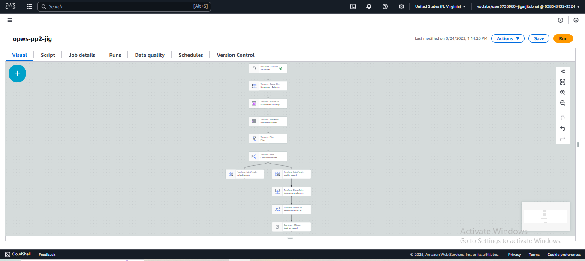

# Data_Analyst_Jigar
# Exploratory Data Analysis

**Project Description:**
Analyzing operating permits of water systems to identify patterns, trends, and anomalies in the permits issued by various categories of mechanical systems, regulatory compliance, and contamination levels.

**Project Title:**
Exploratory Analysis of Water System Operating Permits

**Objective:**
To identify trends in permit issuance, voluntary compliance, and contamination actions to increase regulatory focus and operational priorities.

**Dataset:**
465 records containing operating permits for water systems, mechanical system types, compliance status, geographic information, contamination levels, and renewal dates.

**Methodology:**

- Carry out descriptive statistics (means, medians, and frequency counts).
- Plot data using histograms, scatter graphs, and trend lines.
- Identify missing values, inconsistencies, and variable relationships.

**Tools and Technologies:**
- AWS Data Brew for data profiling
- AWS Glue for ETL pipeline
- Amazon S3 for data storage
- Visualization tools (e.g., Excel or Matplotlib)

**Deliverables:**
- Summary statistics
- Visualizations of permit trends and contamination data
- Insights into compliance and system types

# Descriptive Analysis

**Project Description:**
Those are the attributes of water system permits and their distribution across system types and compliance needs.

**Project Title:**
Descriptive Analysis of Water Permit Issuance

**Objective:**
To determine the distribution of licenses among different system classifications and the difference between voluntary and mandatory compliance categories.

**Dataset:**
Covers 465 water systems, with an emphasis on types such as Cooling Towers, Building Water Treatment Systems, and Decorative Water Features.

**Methodology:**
- Count and percentage distribution of permits per system type.
- Assess compliance participation rates.
- Generate bar charts for voluntary and non-voluntary permit distribution.

**Tools and Technologies:**
- AWS Athena to query permit data
- Excel and Tableau for visualization

**Deliverables:**
- Cooling Tower approvals percentage (86.89%)
- Adherence pattern and operational gap charts

# Diagnostic Analysis

**Project Description:**
Analyzing the determinants of trends in permit renewal and voluntary compliance among heterogeneous groups of mechanical systems.

**Project Title:**
Assessment of Patterns in Permit Reissuance

**Objective:**
In order to ascertain the cause of high renewal times and voluntary compliance that is low.

**Background:**
The statistics reflect a surplus of cooling towers in permit approvals and a rising renewal trend in 2025. Despite the integral role played by Cooling Towers, there is low voluntary compliance.

**Dataset:**
Permit documentation like renewal dates, compliance levels, and pollution levels.

**Methodology:**
- Get data on renewal trends for 2024 to 2026.
- Analyze the connection between compliance and various systems.
- Talk about contamination indicators and their relation to compliance.

**Tools and Technologies:**
- AWS Glue for managing data workflow
- Amazon S3 for storing data
- Tableau for trend visualization

**Deliverables:**
- Renewal trends analysis for 2025
- Causes of compliance

**Timeline:**
- Data extraction: 1 week
- Visualization and analysis: 2 weeks
- Report generation: 1 week

  
# Data Wrangling

**Project Description:**
Examining and modifying permit information regarding water systems for proper assessment and representation.

**Project Title:**
Preparation of Data for Water System Permitting

**Objective:**
To create a clean and organized dataset to analyze and maintain data integrity.

**Background:**
Initial data features absent contamination measurements and whitespace issues within numeric columns.

**Dataset:**
The raw data is kept in an S3 bucket containing 466 permit records.

**Methodology:**
- Use AWS Data Brew for profiling data.
- Utilize Data Glue recipes to eliminate missing values and excess whitespace.
- Processed data conversion and saving in S3.

**Tools and Technologies:**
- AWS Data Brew for analytics
- AWS Glue assists in loading, transformation, and extraction activities.
- Storage in S3 buckets

**Deliverables:**
- Cleaned dataset in S3
- Data cleaning recipes

**Timeline:**
- Data profiling: 3 days
- Data cleaning: 4 days
- Storage and validation: 3 days

# Data Quality Control

**Project Description:**
Maintaining the accuracy and reliability of permit data through management and validation processes.

**Project Title:**
Data Quality Control for Permit Issuance

**Objective:**
To preserve and ensure data quality by means of governance structures and security measures.

**Background:**
Data quality issues such as missing metrics for contamination hinder in-depth analysis. Governance measures and protection are needed.

**Methodology:**
- Established ways of measuring quality and sorting data into successful and unsuccessful groups.
- Apply encryption and replication techniques in Amazon S3 to protect data integrity.
- Use AWS Cloud Watch to track data quality indicators.

**Deliverables:**
- Datasets with quality assurance
- Accounts on succeeded/unsucceeded information
- Datasets that are encrypted and replicated

**Timeline:**

- Pipeline creation: 1.5 week
- Data governance setup: 4 days

  
