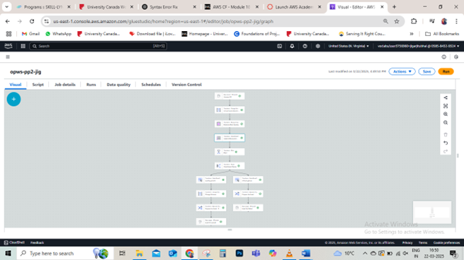

# Data_Analyst_Jigar
# Exploratory Data Analysis

**Project Description:**
Analyzing operating permits of water systems to identify patterns, trends, and anomalies in the permits issued by various categories of mechanical systems, regulatory compliance, and contamination levels.

**Project Title:**
Exploratory Analysis of Water System Operating Permits

**Objective:**
To identify trends in permit issuance, voluntary compliance, and contamination actions to increase regulatory focus and operational priorities.

**Dataset:**
465 records containing operating permits for water systems, mechanical system types, compliance status, geographic information, contamination levels, and renewal dates.

**Methodology:**

- Carry out descriptive statistics (means, medians, and frequency counts).
- Plot data using histograms, scatter graphs, and trend lines.
- Identify missing values, inconsistencies, and variable relationships.

**Tools and Technologies:**
- AWS Data Brew for data profiling
- AWS Glue for ETL pipeline
- Amazon S3 for data storage
- Visualization tools (e.g., Excel or Matplotlib)

**Deliverables:**
- Summary statistics
- Visualizations of permit trends and contamination data
- Insights into compliance and system types

# Descriptive Analysis

**Project Description:**
Those are the attributes of water system permits and their distribution across system types and compliance needs.

**Project Title:**
Descriptive Analysis of Water Permit Issuance

**Objective:**
To determine the distribution of licenses among different system classifications and the difference between voluntary and mandatory compliance categories.

**Dataset:**
Covers 465 water systems, with an emphasis on types such as Cooling Towers, Building Water Treatment Systems, and Decorative Water Features.

**Methodology:**
- Count and percentage distribution of permits per system type.
- Assess compliance participation rates.
- Generate bar charts for voluntary and non-voluntary permit distribution.

**Tools and Technologies:**
- AWS Athena to query permit data
- Excel and Tableau for visualization

**Deliverables:**
- Cooling Tower approvals percentage (86.89%)
- Adherence pattern and operational gap charts

# Diagnostic Analysis

**Project Description:**
Analyzing the determinants of trends in permit renewal and voluntary compliance among heterogeneous groups of mechanical systems.

**Project Title:**
Assessment of Patterns in Permit Reissuance

**Objective:**
In order to ascertain the cause of high renewal times and voluntary compliance that is low.

**Background:**
The statistics reflect a surplus of cooling towers in permit approvals and a rising renewal trend in 2025. Despite the integral role played by Cooling Towers, there is low voluntary compliance.

**Dataset:**
Permit documentation like renewal dates, compliance levels, and pollution levels.

**Methodology:**
- Get data on renewal trends for 2024 to 2026.
- Analyze the connection between compliance and various systems.
- Talk about contamination indicators and their relation to compliance.

**Tools and Technologies:**
- AWS Glue for managing data workflow
- Amazon S3 for storing data
- Tableau for trend visualization

**Deliverables:**
- Renewal trends analysis for 2025
- Causes of compliance

**Timeline:**
- Data extraction: 1 week
- Visualization and analysis: 2 weeks
- Report generation: 1 week

  
# Data Wrangling

**Project Description:**
Cleaning and transforming water system permit data for accurate analysis and visualization.

**Project Title:**
Data Wrangling for Water System Permits

**Objective:**
To prepare a clean and structured dataset for analysis and ensure data quality.

**Background:**
Initial data contains missing contamination metrics and whitespace issues in numerical columns.

**Dataset:**
Raw dataset stored in S3 bucket with 472 permit records.

**Methodology:**
- Profile data using AWS Data Brew.
- Clean missing values and whitespace using Data Glue recipes.
- Transform and store cleaned data in S3.

**Tools and Technologies:**
- AWS Data Brew for profiling
- AWS Glue for ETL tasks
- S3 buckets for storage

**Deliverables:**
- Cleaned dataset in S3
- Data cleaning recipes

**Timeline:**
- Data profiling: 2 days
- Data cleaning: 5 days
- Storage and validation: 2 days

# Data Quality Control

**Project Description:**
Ensuring the reliability and accuracy of permit data through validation and governance measures.

**Project Title:**
Data Quality Control for Permit Issuance Records

**Objective:**
To validate and maintain data quality through governance frameworks and security mechanisms.

**Background:**
Data quality issues, such as incomplete contamination metrics, hinder comprehensive analysis. Steps for governance and protection are critical.

**Scope:**
Focus on improving data reliability for exploratory and diagnostic analysis.

**Methodology:**
- Create pipelines for quality assessment and segregation of passed/failed data.
- Implement encryption and replication rules in S3 for data protection.
- Monitor data quality metrics using AWS CloudWatch.

**Deliverables:**
- Quality-assured datasets
- Reports on passed/failed data
- Encrypted and replicated datasets

**Timeline:**

- Pipeline creation: 1 week
- Data governance setup: 3 days
